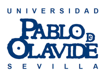

Carlos Usabiaga is a Full Professor of Economics at the *Department of Economics, Quantitative Methods and Economic History* of **Pablo de Olavide University**. His **research interests** include Macroeconomics, Labour Economics, Regional Economics, Economic Growth, Spanish and Andalusian economies.

 Download my resumé.

 Download my recent publications.

 Download my selected publications.
